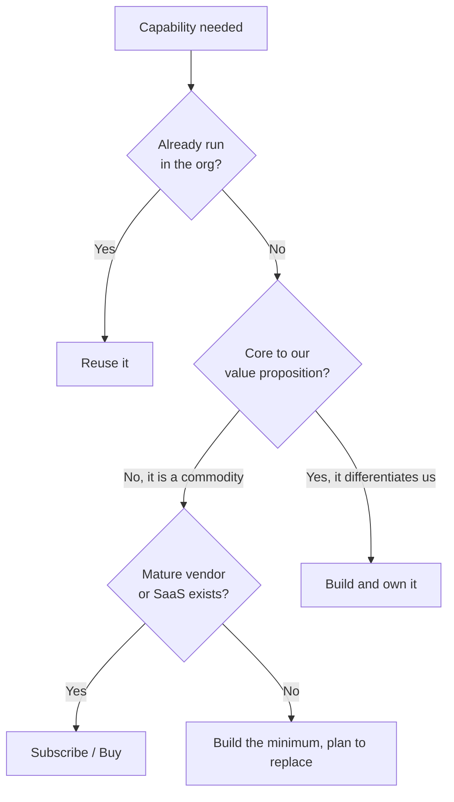

# Decision Framework

Before building something new, adopting a tool, or making a significant change, run
the decision through the ten questions below. They are deliberately general: the same
questions apply to a library choice, a new service, a schema migration, or a
build-versus-subscribe call. The framework does not make the decision for you — it
makes sure you have not skipped the question that comes back to bite you.

## How to use this

- Answer every question honestly. A question you _cannot_ answer is itself a finding — go get the answer.
- Scale the rigour to the stakes. Not every decision needs all ten written down; every decision needs them _considered_.
- The output is a decision plus its reasoning. For anything significant, [record it](#recording-the-decision).

### Weigh the decision first

The cost of a wrong decision is dominated by how hard it is to undo. Classify it before you spend effort on it.

| Decision type                      | Examples                                                              | What the framework asks of you                                                   |
| ---------------------------------- | --------------------------------------------------------------------- | -------------------------------------------------------------------------------- |
| **Two-way door** (reversible)      | Adding a well-scoped library, an internal tool choice, a feature flag | A quick mental pass. Decide, ship, revisit if wrong.                             |
| **One-way door** (hard to reverse) | Public API shape, datastore choice, auth model, a vendor you build on | Answer every question _in writing_ and get a second opinion.                     |
| **Irreversible**                   | Destructive migration, data deletion, deprecating a public contract   | All of the above, plus explicit sign-off and a tested rollback/rollforward plan. |

> **TODO(owner):** confirm which decision classes require an ADR versus an RFC versus a lead's approval. Placeholder mapping until then: one-way door → ADR; cross-team → RFC.

## Quick reference

| #   | Question                                           | What you are really checking        | Governed by                                                            |
| --- | -------------------------------------------------- | ----------------------------------- | ---------------------------------------------------------------------- |
| 1   | Does this solve the actual problem?                | Problem is named, not assumed       | [Principles](01-engineering-principles/principles.md)                  |
| 2   | Is there an existing solution in the organisation? | Reuse before adopt before build     | [Ownership](02-people-and-responsibilities/ownership-model.md)         |
| 3   | Can it be simpler?                                 | The smallest thing that works       | [Principles](01-engineering-principles/principles.md)                  |
| 4   | Will it still make sense in two years?             | Longevity, not just today's scale   | [Architecture](04-architecture/README.md)                              |
| 5   | Is it observable?                                  | You can tell if it is healthy       | [Observability](09-operations/observability/README.md)                 |
| 6   | Is it secure?                                      | New attack surface is accounted for | [Security](05-security/README.md)                                      |
| 7   | Is it backwards compatible?                        | Nothing downstream silently breaks  | [Backward Compatibility](08-delivery/backward-compatibility/README.md) |
| 8   | Can it be rolled back safely?                      | A tested way to undo it             | [Promotion and Rollback](08-delivery/ci-cd/promotion-and-rollback.md)  |
| 9   | What is the operational cost?                      | Someone owns the running cost       | [Runbooks](09-operations/runbooks.md)                                  |
| 10  | What technical debt does this introduce?           | The debt is named and scheduled     | [Technical Debt](10-governance/technical-debt.md)                      |

## The ten questions

### 1. Does this solve the actual problem?

State the problem first and the solution second. If you cannot write the problem in one
sentence, you are not ready to choose a solution.

- **Good signs:** the problem is measurable; you can say what "solved" looks like; the solution maps directly to the need.
- **Red flags:** the solution came first and you are reverse-engineering a problem for it; "we might need it later"; solving a symptom, not the cause.
- See: [Engineering Principles](01-engineering-principles/principles.md).

### 2. Is there an existing solution in the organisation?

Reuse before adopt, adopt before build. A slightly imperfect internal solution usually
beats a new thing to learn, operate, and own.

- **Good signs:** you checked with other teams and the platform; an existing service or library covers most of the need.
- **Red flags:** building in isolation; a second implementation of something we already run; "ours will be better" without evidence.
- See: [Ownership Model](02-people-and-responsibilities/ownership-model.md).

### 3. Can it be simpler?

Complexity is a permanent tax paid by everyone who touches the system afterwards. Prefer
the smallest design that solves the problem.

- **Good signs:** you can remove a component and it still works — so you removed it; the design fits in one diagram.
- **Red flags:** speculative generality; abstractions with a single caller; a framework where a function would do.

### 4. Will it still make sense in two years?

Weigh the decision against likely growth, team turnover, and the direction of the platform.
Favour boring, well-supported technology over novelty you will maintain alone.

- **Good signs:** active upstream, broad adoption, an obvious migration path if you outgrow it.
- **Red flags:** a choice that only holds at today's scale; a niche tool with one maintainer; resume-driven selection.

### 5. Is it observable?

If it fails silently it is not production-ready. You must be able to answer "is it healthy?"
without SSH-ing into a box.

- **Good signs:** logs, metrics, traces, and alerts are part of the design, not bolted on later.
- **Red flags:** no way to see it working; alerting "to be added"; failures only surface as user complaints.
- See: [Observability](09-operations/observability/README.md).

### 6. Is it secure?

Consider authentication, authorisation, data exposure, secret handling, and the attack
surface you are adding. New dependencies and new services both widen what an attacker can reach.

- **Good signs:** least privilege by default; secrets managed, not embedded; data classified and protected in transit and at rest.
- **Red flags:** a new public endpoint with no threat model; a dependency no one has vetted; "we'll secure it before launch".
- See: [Security](05-security/README.md).

### 7. Is it backwards compatible?

Identify everything that depends on current behaviour — APIs, events, schemas, client
versions. If the change breaks compatibility, it needs a migration and a deprecation path.

- **Good signs:** additive changes; versioned interfaces; a plan for existing consumers.
- **Red flags:** changing a field's meaning in place; removing something still in use; assuming all clients update at once.
- See: [Backward Compatibility](08-delivery/backward-compatibility/README.md).

### 8. Can it be rolled back safely?

Prefer two-way doors. Know the exact steps to undo the change while it is under load, and
be honest about which parts cannot be undone.

- **Good signs:** deploys are reversible; migrations are expand/contract; rollback is tested, not theoretical.
- **Red flags:** a destructive migration with no path back; state that cannot be reconstructed; "we just won't need to roll back".
- See: [Promotion and Rollback](08-delivery/ci-cd/promotion-and-rollback.md).

### 9. What is the operational cost?

Account for the full running cost: infrastructure, licences, on-call burden, and toil.
Someone has to operate this — name them, and make sure a runbook will exist.

- **Good signs:** the owning team is identified and agrees; cost is estimated; toil is designed out where possible.
- **Red flags:** no named owner; recurring manual work with every use; cost that grows faster than the value it delivers.
- See: [Runbooks](09-operations/runbooks.md).
- > **TODO(owner):** confirm the recurring-spend threshold above which a decision needs finance/architecture sign-off. Placeholder: `<COST_SIGNOFF_THRESHOLD>`.

### 10. What technical debt does this introduce?

Every shortcut creates debt; an _unnamed_ shortcut creates invisible debt. Make the
trade-off explicit and say how it will be paid down.

- **Good signs:** shortcuts are documented with a ticket and a trigger for repayment; the debt is a conscious choice.
- **Red flags:** "temporary" solutions with no removal date; TODOs that never become tickets; debt taken on silently.
- See: [Technical Debt](10-governance/technical-debt.md).

## Build, buy, or subscribe?

When the decision is specifically _how_ to obtain a capability, walk this path — then still
answer the ten questions for whichever branch you land on.

- **Commodity capability** (auth, email, payments, logging): subscribe or buy unless a hard constraint forces otherwise. Undifferentiated work is not worth owning.
- **Differentiating capability** (the thing customers pay _us_ for): build and own it. Do not outsource your edge.
- **In between:** buy to move fast now, and keep the option to bring it in-house later — record that intent so it is not forgotten.

## Anti-patterns

- **Solution-first.** Falling for a tool and then justifying it. Question 1 exists to catch this.
- **Not-invented-here.** Rebuilding what the org already runs. Question 2 exists to catch this.
- **Resume-driven development.** Choosing tech for its novelty, not the problem. Questions 3 and 4 catch this.
- **Deciding in your head.** Making a one-way-door call with no written record. See below.

## Recording the decision

For anything significant or hard to reverse, the reasoning must outlive the conversation:

- **Architecture-level or long-lived** → write an [ADR](04-architecture/decision-records/README.md).
- **Cross-team or needs buy-in before building** → raise an [RFC](08-delivery/change-management/rfc-process.md).

A good record shows:

- [ ] The problem, in one sentence.
- [ ] The options considered — including "do nothing".
- [ ] The answers to the questions above that drove the choice.
- [ ] The chosen option, its known trade-offs, and the debt it accepts.
- [ ] Who approved it, and how it can be reversed.
